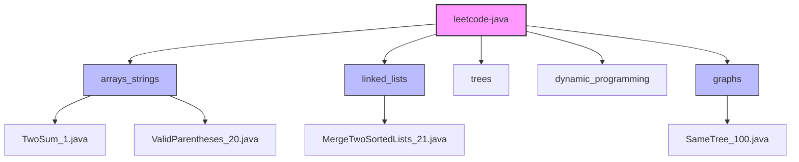

# 🚀 LeetCode Java Solutions

Welcome to my personal collection of LeetCode solutions implemented in Java. This repository serves as a showcase of my algorithmic knowledge, coding style, and problem-solving skills.

## 🎯 Goal

The primary goal of this project is to provide high-quality, efficient, and well-documented solutions to common algorithmic problems. Each solution is crafted with:
- **Efficiency**: Optimized for Time and Space complexity.
- **Clarity**: Detailed "Chain of Thought" explanations and line-by-line comments.
- **Robustness**: Includes a `main` function with test cases for immediate verification.

## 📂 Structure

The repository is organized by topic to facilitate easy navigation and study.



## 🧠 Solution Philosophy

Every solution file follows a strict structure to ensure maximum understandability:

1.  **Problem Description**: The full problem statement at the top.
2.  **Chain of Thought**: A step-by-step explanation of how the solution was derived, including alternative approaches considered.
3.  **Complexity Analysis**: Explicit Big-O analysis for Time and Space complexity.
4.  **Annotated Code**: The solution code is heavily commented to explain *why* a specific line was written.
5.  **Runnable Main**: A `main` method demonstrating the solution with various test cases.

## 📚 Solved Problems

| # | Problem | Difficulty | Topic | Solution |
|---|---|---|---|---|
| 1 | [Two Sum](https://leetcode.com/problems/two-sum/) | Easy | Arrays & HashMaps | [Java](src/arrays_strings/TwoSum_1.java) |
| 14 | [Longest Common Prefix](https://leetcode.com/problems/longest-common-prefix/) | Easy | Strings | [Java](src/arrays_strings/LongestCommonPrefix_14.java) |
| 20 | [Valid Parentheses](https://leetcode.com/problems/valid-parentheses/) | Easy | Stacks/Strings | [Java](src/arrays_strings/ValidParentheses_20.java) |
| 21 | [Merge Two Sorted Lists](https://leetcode.com/problems/merge-two-sorted-lists/) | Easy | Linked Lists | [Java](src/linked_lists/MergeTwoSortedLists_21.java) |
| 66 | [Plus One](https://leetcode.com/problems/plus-one/) | Easy | Arrays | [Java](src/arrays_strings/PlusOne_66.java) |
| 67 | [Add Binary](https://leetcode.com/problems/add-binary/) | Easy | Strings/Math | [Java](src/arrays_strings/AddBinary_67.java) |
| 100 | [Same Tree](https://leetcode.com/problems/same-tree/) | Easy | Graphs/Trees | [Java](src/graphs/SameTree_100.java) |
| 392 | [Is Subsequence](https://leetcode.com/problems/is-subsequence/) | Easy | Strings/Two Pointers | [Java](src/arrays_strings/IsSubsequence_392.java) |
| 1768 | [Merge Strings Alternately](https://leetcode.com/problems/merge-strings-alternately/) | Easy | Strings | [Java](src/arrays_strings/MergeStringsAlternately_1768.java) |

## 🏃 How to Run

You can run any solution directly from the command line or your IDE.

**Example:**
```bash
javac src/arrays_strings/TwoSum_1.java
java -cp src arrays_strings.TwoSum_1
```

---
*Created by [Nadav Ramon](https://github.com/nadavramon)*